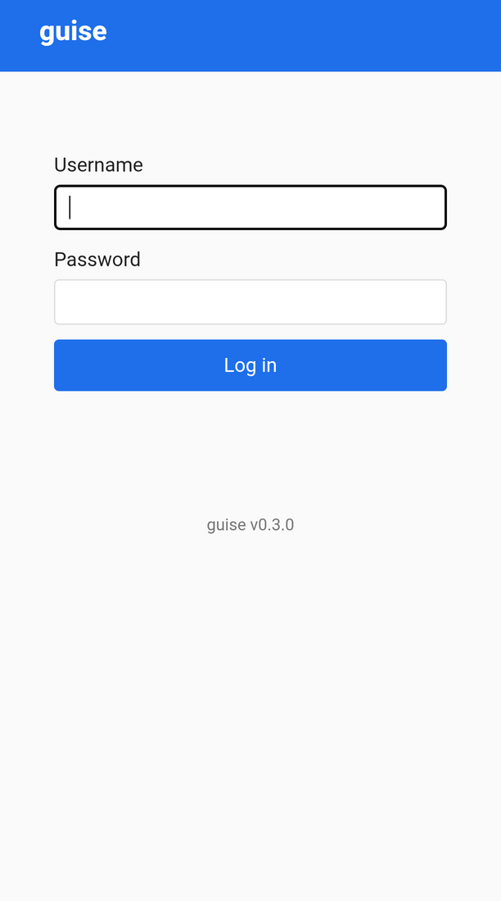
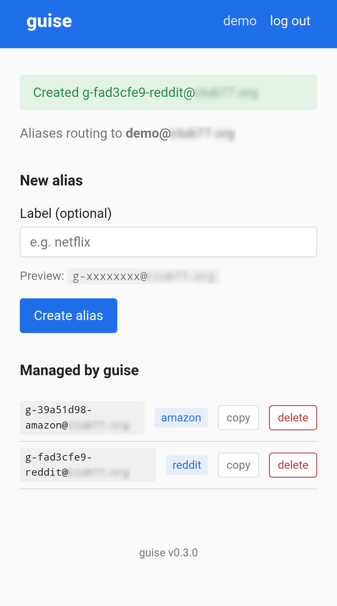

# guise

[](LICENSE)
[](https://github.com/messelink/guise/actions/workflows/tests.yml)
[](https://github.com/messelink/guise/actions/workflows/codeql.yml)
[](https://sonarcloud.io/summary/new_code?id=messelink_guise)

> Copyright (C) 2026 Pim Messelink &lt;g-2eebed68-guise@club77.org&gt;
> Licensed under the GNU Affero General Public License v3.0 or later. See `LICENSE`.

Self-hosted web app for managing per-recipient email aliases on a [`docker-mailserver`](https://github.com/docker-mailserver/docker-mailserver) instance, without SSH. Generates random alias addresses labeled with the service they're for, e.g. `g-a3f82c11-netflix@example.com`, and routes them to your real mailbox. Bitwarden's *Forwarded email alias* generator can create them directly from any sign-up form (via a SimpleLogin-compatible API; see below).

Auth piggybacks on the mailserver itself (IMAP), so there's no separate user database. Aliases live in `postfix-virtual.cf`, and the embedded label travels in the address itself — guise owns no application data of its own beyond a regenerable session key.

## Why random aliases instead of sub-addressing?

A sub-addressed address (e.g. `user+netflix@example.com`) reveals your real mailbox to anyone who reads it. If one service leaks its user list and addresses follow `user+<service>@…`, an attacker can probe `user+<every-other-service>@…` to link your identity across services. Random-prefix aliases break both: `g-a3f82c11-netflix@example.com` reveals nothing about the mailbox and doesn't correlate with `g-5b2e1c8a-bank@example.com`. The embedded label is just operator ergonomics — sub-addressing has "which alias did I use here?" for free, and the label is how guise gets that back.

## Screenshots

### Login



### Dashboard



## Repo layout

```
guise/
├── README.md              this file
├── LICENSE                AGPL-3.0
├── CHANGELOG.md
├── CONTRIBUTING.md
├── SECURITY.md
├── INSTALL.md             reverse-proxy alternatives (Caddy/Apache/nginx/Traefik)
├── docs/                  api.md — SimpleLogin-compatible HTTP API spec
├── screenshots/           login + dashboard
├── .github/workflows/     GitHub Actions CI (pytest, CodeQL, release)
└── server/                Python/Flask source for the guise Docker image
```

`server/` builds the image; the running deployment is a sidecar service inside your `docker-mailserver` compose project. Prebuilt images are published to GitHub Container Registry at `ghcr.io/messelink/guise` for `linux/amd64` and `linux/arm64`.

## Quickstart

Add the two services below to your `docker-mailserver` `compose.yaml`, alongside the existing `mailserver` service. The `guise-socket-proxy` sidecar restricts guise's Docker API access to only the container-listing and exec endpoints it needs to write aliases — an RCE in guise can no longer touch the host Docker daemon directly. See [`server/README.md`](server/README.md) for the trust-boundary rationale.

```yaml
  guise-socket-proxy:
    image: tecnativa/docker-socket-proxy:latest
    container_name: guise-socket-proxy
    restart: always
    environment:
      CONTAINERS: 1   # allow GET on /containers/*
      EXEC: 1         # allow POST on /containers/{id}/exec and /exec/{id}/start
      POST: 1         # allow POST requests in general
    volumes:
      - /var/run/docker.sock:/var/run/docker.sock:ro
    # not exposed on the host; only reachable from the project's docker network

  guise:
    image: ghcr.io/messelink/guise:latest
    container_name: guise
    restart: always
    ports: ["127.0.0.1:9100:8000"]
    volumes:
      - ./guise-data:/data
    environment:
      GUISE_DOMAIN: example.com               # your mail domain
      GUISE_TAG: g-
      GUISE_DENIED_USERS: noreply,admin,bot   # service accounts to block
      GUISE_MAILSERVER_CONTAINER: mailserver
      GUISE_IMAP_HOST: mailserver
      GUISE_IMAP_PORT: "993"
      DATA_DIR: /data
      SESSION_COOKIE_SECURE: "true"
      DOCKER_HOST: tcp://guise-socket-proxy:2375
    depends_on:
      - mailserver
      - guise-socket-proxy
```

Then from your docker-mailserver compose project directory:

```
mkdir -p guise-data
docker compose pull guise guise-socket-proxy
docker compose up -d guise guise-socket-proxy
```

To pin a specific version instead of tracking `:latest`, use `ghcr.io/messelink/guise:0.3.0` (or any tag from the [Releases page](https://github.com/messelink/guise/releases)). Upgrades are then a `docker compose pull guise && docker compose up -d --force-recreate guise`.

### Build from source instead

If you'd rather not pull a prebuilt image:

```
cd guise/server
make build         # produces local guise:latest
```

…then use `image: guise:latest` in the compose block above.

## Reverse proxy

guise listens on `127.0.0.1:9100`. Front it with any reverse proxy that can terminate TLS. The simplest is Caddy:

```Caddyfile
guise.example.com {
    reverse_proxy 127.0.0.1:9100
}
```

Caddy auto-provisions and renews a Let's Encrypt certificate. Point DNS at the host and that's the whole config.

For Apache, nginx, Traefik, caddy-docker-proxy, and other variants, see [INSTALL.md](INSTALL.md).

## SimpleLogin-compatible API

guise exposes the subset of the [SimpleLogin REST API](https://github.com/simple-login/app/blob/master/docs/api.md) that password-manager "forwarded email alias" generators rely on. Any client that supports pointing at a *self-hosted* SimpleLogin server should be able to create guise aliases without modification.

Point your client at `https://guise.example.com`; the API key is your mailbox short-username and IMAP password joined by `:` — same auth path as the web UI, no separate token to manage. For example, if your mailbox is `alice@example.com` and your IMAP password is `s3cret-imap-password`, the API key is `alice:s3cret-imap-password`.

Bitwarden is the verified-working client (browser extension, mobile, desktop). Any other SimpleLogin client with a self-hosted server URL setting should also work — open an issue if you confirm one. Auto-labeling from the request URL is opt-out per instance via `GUISE_API_AUTOLABEL=0`.

Full request/response spec, error codes, and the SimpleLogin subset implemented are in [`docs/api.md`](docs/api.md).

## User flow

### Via the web UI

1. Browse to `https://guise.example.com/login`
2. Log in with your short mailserver username + password
3. Dashboard shows two sections:
   - **Managed by guise** — addresses starting with `g-`, with their labels
   - **Other aliases routing to you** — anything else in `postfix-virtual.cf` pointing to your address (pre-existing aliases). Deleting one of these prompts an extra confirmation.
4. Type a label, click *Create alias* → fresh `g-<8 hex>-<label>` address appears, ready to copy.
5. Click *delete* on any alias to remove it.

### Via Bitwarden

1. In Bitwarden, configure *Username Generator → Forwarded email alias → SimpleLogin (self-hosted server)*. Server URL: `https://guise.example.com`. API key: `<your-username>:<your-imap-password>` (your mailbox short-username and IMAP password joined by a colon).
2. On any sign-up form, focus the email/username field. Bitwarden's in-page bubble offers *Generate*: pick *Forwarded email alias* → a fresh `g-<random>-<site>@<domain>` alias appears and gets pasted.
3. Manage or delete the alias later via the web UI's *Managed by guise* section.

## Rollback

```
docker compose stop guise guise-socket-proxy
docker compose rm -f guise guise-socket-proxy
# remove both service blocks from compose.yaml
rm -rf guise-data
docker image rm ghcr.io/messelink/guise:latest tecnativa/docker-socket-proxy:latest
```

Mailserver is untouched.

## Development

See [`server/README.md`](server/README.md) for build/test details.
